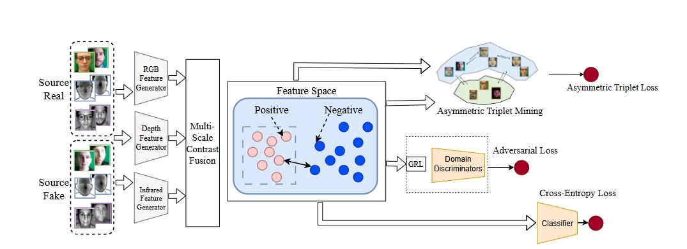

# CA-MMDG
The implementation of [**Contrast and Adversarial: Towards Generalized Multi-Modal Face Anti-Spoofing**].

The motivation of the proposed CA-MMDG method:



## Datasets and Python environment
- CASIA-CeFA (denoted as C), [PADISI-Face](https://github.com/vimal-isi-edu/PADISI_USC_Dataset/blob/main/README_FACE.md)  , CASIA-SURF (denoted as S) , and [WMCA]((https://www.idiap.ch/en/scientific-research/data/wmca)) 

  - PyTorch 1.11.0

    Python 3.8(ubuntu20.04)

    CUDA 11.3

## Training

```python
python train.py
```

The file `config.py` contains all the hype-parameters used during training.

## Testing

Run like this:
```python
python test.py
```

## Citation
Please cite these papers if the code is helpful to your research.
```
@article{zhang2025domain,
  title={Domain generalization for multi-modal face anti-spoofing via MixCropMask Augmentation and deep hybrid-level fusion},
  author={Zhang, Botao and Li, Hongjiao},
  journal={Engineering Applications of Artificial Intelligence},
  volume={158},
  pages={111287},
  year={2025},
  publisher={Elsevier}
}

@inproceedings{jia2020single,
  title={Single-side domain generalization for face anti-spoofing},
  author={Jia, Yunpei and Zhang, Jie and Shan, Shiguang and Chen, Xilin},
  booktitle={Proceedings of the IEEE/CVF conference on computer vision and pattern recognition},
  pages={8484--8493},
  year={2020}
}
```


